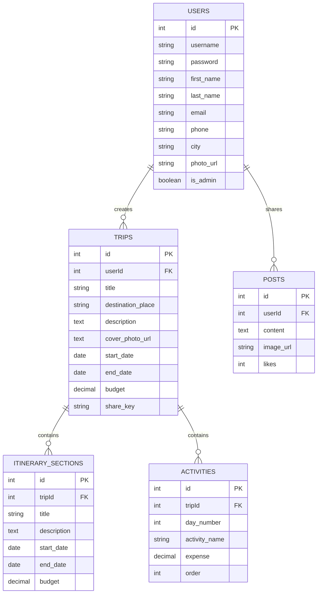

# ✈️ GlobalTrotter — Empowering Personalized Travel Planning

<div align="center">

  

  ### *Dream. Design. Explore.*
  **An end-to-end, intelligent multi-city travel planning platform built for modern wanderers.**

  
  
  
  

</div>

---

## 🌟 Overarching Vision & Mission

**GlobalTrotter** simplifies the complexity of planning multi-city travel. It transforms fragmented travel research into a seamless, interactive, and collaborative itinerary dashboard.

Travelers can explore global destinations, visualize their journeys through structured day-by-day flowcharts, estimate trip budgets automatically in **Indian Rupees (₹)**, and share itineraries with a vibrant community.

---

## ✨ Key Features & Capabilities

### 🔐 1. Split-Screen Authentication (Screen 2)
- **Cinematic Experience**: Full-screen travel photography background with dark gradient overlays.
- **Micro-Animations**: Panel slide-ins, floating avatar, and cascading staggered form elements.
- **Robust Security**: Passwords hashed with `bcryptjs`, session managed via JWT tokens.
- **Profile Customization**: Photo upload, phone number, city, and bio preferences.

### 🏠 2. Dynamic Landing & Dashboard (Screen 1 & 4)
- **Personalized Welcome**: Custom hero greeting displaying upcoming and past trip metrics.
- **Regional Inspiration**: Curated 6-card destination highlights (Paris, Goa, New York, Interlaken, London, Bali).
- **Status Filter Tabs**: Filter trips by `All`, `Upcoming`, `Ongoing`, and `Completed`.
- **Quick Action Bar**: One-click access to "Plan a New Trip".

### 🗺️ 3. Multi-City Trip Planner & Suggestions (Screen 3 & 5)
- **Trip Setup**: Specify trip title, destination place, description, start date, end date, and overall trip budget in **₹**.
- **Cover Photo Upload**: Support for custom image URLs or direct photo selection.
- **Smart Suggestions**: City-specific activity ideas automatically suggested below the creation form.

### 📅 4. Day-Wise Timeline & Itinerary Builder (Screen 5, 6 & 10)
- **Day-by-Day Flowchart**: Physical activity node cards mapped sequentially per day.
- **Inline Activity Adder**: Quickly add activities with estimated costs (₹) directly into any day.
- **Visual Calendar View**: Full monthly calendar view (`/calendar`) marking scheduled trip dates.

### 💰 5. Smart Budget & Cost Analytics (Screen 9)
- **Financial Breakdown**:
  - 💵 **Total Trip Budget (₹)**
  - 📊 **Total Spent (₹)**
  - 💳 **Remaining Balance (₹)**
  - 🗓️ **Average Cost per Day (₹)**
- **Budget Health Bar**: Dynamic progress bar indicating budget usage percentage (turns red when over-budget).
- **Interactive SVG Bar Chart**: Visual daily spend breakdown with dashed budget target line.

### 🔍 6. Live Activity & City Search Engine (Screen 7 & 8)
- **Live Autocomplete**: Dropdown suggestions matching queries across 35+ Indian cities and adventures.
- **Filter Chips**: Instant filtering by category (*Adventure, Culture, Dining, Sightseeing, Views*).
- **One-Click Add**: Add searched activities directly into any scheduled trip.

### 🌐 7. Public Shareable Itinerary & One-Click Cloning (Screen 11)
- **Unique Share Links**: Generate unique public URLs (`/shared/<share_key>`) for any trip.
- **Read-Only Shared View**: Accessible to non-logged-in visitors displaying full timeline and budget.
- **Copy Trip Button**: Logged-in users can clone any shared itinerary (including all days and activities) into their own account with one click!

### 💬 8. Social Community Feed
- **Travel Stories**: Share trip highlights, photo updates, and travel advice with the community.
- **Like & Interact**: Engaging social card layout with live likes count.

### 📊 9. Admin Dashboard & Analytics (Screen 12 & 13)
- **User Management**: Admin tools to inspect user directories, toggle admin permissions, or remove accounts.
- **Platform Analytics**: Dynamic SVG Line Chart tracking user registrations and Bar Chart tracking trip allocations.
- **Smooth Tab Transitions**: CSS keyframe `animated-fade` tab switching between analytics tabs.

---

## 🛠️ Technology Stack

| Layer | Technologies |
|---|---|
| **Frontend** | React 18, Vite, Lucide React (Icons), Vanilla CSS (Custom Design System & Tokens) |
| **Backend** | Node.js, Express.js, Sequelize ORM, Multer, Crypto |
| **Database** | MySQL (Relational Schema with Foreign Key Constraints) |
| **Authentication** | JSON Web Tokens (JWT), Bcrypt Password Hashing |

---

## 🗄️ Database Architecture & Relational Schema



---

## 🔑 Demo Credentials for Judges & Reviewers

The system comes pre-seeded with initial data for instant testing:

| Role | Username | Password | Access Level |
|---|---|---|---|
| **System Administrator** | `admin` | `admin123` | Admin Panel (`/admin`), User Management & Platform Analytics |
| **Traveler User** | `john` | `password123` | Full Trip Planning, Itinerary Builder, Community & Search |

---

## 🚀 Quick Start & Installation

### Prerequisites
- **Node.js** v18+ installed
- **MySQL** Server running on `localhost:3306`

### 1. Clone the Repository
```bash
git clone https://github.com/kajaljain0820/odoo.git
cd odoo
```

### 2. Install Dependencies
```bash
npm run install-all
```

### 3. Environment Setup
Create a `.env` file in the `server/` directory:
```env
PORT=5000
DB_HOST=localhost
DB_PORT=3306
DB_USER=root
DB_PASSWORD=YOUR_MYSQL_PASSWORD
DB_NAME=global_trotter_db
JWT_SECRET=globaltrotter_super_secret_key_2026
```

### 4. Run the Development Server
```bash
npm run dev
```
- **Frontend App**: `http://localhost:5173`
- **Backend API**: `http://localhost:5000`

> *Note: Database creation, table migrations, and seed data initialization happen automatically on server start!*

---

## 📋 Hackathon Compliance Matrix (13/13 Screens)

| # | Wireframe / Feature Requirement | Status | Implementation Details |
|---|---|---|---|
| 1 | Login / Signup Screen | ✅ **100%** | Animated split-screen layout with Unsplash photo background (`Login.jsx`, `Register.jsx`) |
| 2 | Dashboard / Home Screen | ✅ **100%** | Personalized greeting, trip summary cards, explore grid (`Landing.jsx`) |
| 3 | Create Trip Screen | ✅ **100%** | Title, dates, city, budget (₹), description, cover photo, & suggestions (`CreateTrip.jsx`) |
| 4 | My Trips (Trip List) Screen | ✅ **100%** | Filter tabs (`All`/`Upcoming`/`Ongoing`/`Completed`), search & sort (`TripListing.jsx`) |
| 5 | Itinerary Builder Screen | ✅ **100%** | Stop creation with dates, descriptions & budget (`ItineraryBuilder.jsx`) |
| 6 | Itinerary View Screen | ✅ **100%** | Day-by-day activity flowchart with cost breakdown & over-budget alerts (`ItineraryView.jsx`) |
| 7 | City Search | ✅ **100%** | Live search engine with autocomplete & meta cards (`SearchResults.jsx`) |
| 8 | Activity Search | ✅ **100%** | Category filter chips (*Adventure, Culture, Views*), 35+ Indian activities (`SearchResults.jsx`) |
| 9 | Trip Budget & Cost Breakdown | ✅ **100%** | Stat cards, budget used progress bar, & SVG daily spend bar chart (`ItineraryView.jsx`) |
| 10 | Trip Calendar / Timeline Screen | ✅ **100%** | Interactive monthly calendar view with trip markers (`CalendarView.jsx`) |
| 11 | Shared / Public Itinerary View | ✅ **100%** | Public share URL (`/shared/:shareKey`) + one-click **"Copy Trip to My Account"** (`PublicTripView.jsx`) |
| 12 | User Profile / Settings Screen | ✅ **100%** | Editable user details, photo upload, trip history, & Account Deletion (`Profile.jsx`) |
| 13 | Admin Dashboard & Analytics | ✅ **100%** | User management tools, popular cities/activities, & SVG growth charts (`AdminPanel.jsx`) |

---

<div align="center">

Made with ❤️ for the Hackathon by Team GlobalTrotter

</div>
